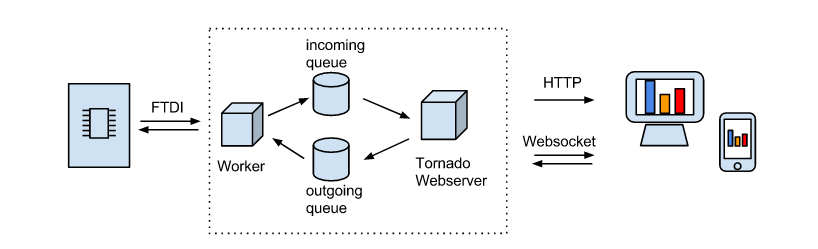

# python-websockets-serial-console
Python Web-based Serial Console using WebSockets
## Requirements and Architecture
Before digging into the details let's describe the requirements:

* we have a device communicating via serial protocol to a computer, often using an FTDI interface
* we want to send data to and read data from the serial port, this could be commands or raw data coming from sensors
* we want to manipulate this data in a HTML webpage using Javascript
* we want the communication not to happen by "polling", i.e. querying the webserver for changes every once in a while, but by keeping an always-open communication channel from the webpage to the webserver, using the Web Sockets standard

So this is our architecture:

